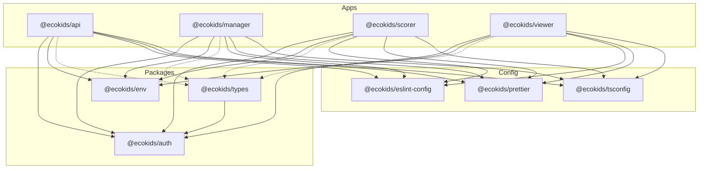
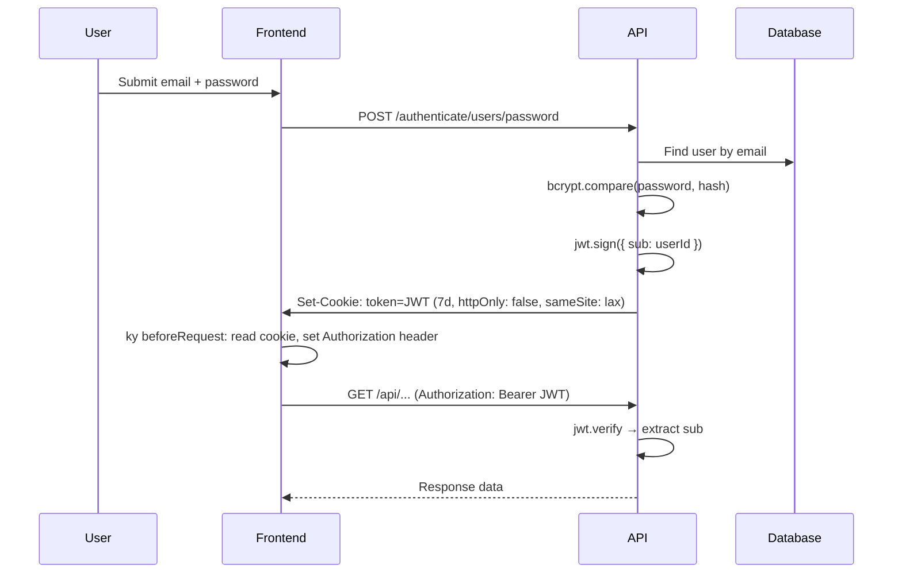

# ARCHITECTURE.md

> High-level architecture, module boundaries, package relationships, and system flow.

---

## System Overview

Ecokids is a **Turborepo monorepo** containing four applications and three shared packages that together form a school-based recycling rewards platform.

```
┌─────────────────────────────────────────────────────────────┐
│                        Frontend Apps                        │
│  ┌──────────┐   ┌──────────┐   ┌──────────┐                │
│  │ Manager  │   │  Scorer  │   │  Viewer  │                │
│  │ (Vite)   │   │ (Vite)   │   │ (Vite)   │                │
│  │ :5173    │   │ :5174    │   │ :5175    │                │
│  └────┬─────┘   └────┬─────┘   └────┬─────┘                │
│       │              │              │                       │
│       └──────────────┼──────────────┘                       │
│                      │ HTTP (ky)                            │
│                      ▼                                      │
│  ┌──────────────────────────────────┐                       │
│  │          API (Fastify)           │                       │
│  │           :3333                  │                       │
│  └───────┬──────────────┬───────────┘                       │
│          │              │                                   │
│          ▼              ▼                                   │
│  ┌──────────┐   ┌──────────────┐                            │
│  │PostgreSQL│   │ Cloudflare R2│                            │
│  │ (Docker) │   │   (S3 API)   │                            │
│  │  :5432   │   │              │                            │
│  └──────────┘   └──────────────┘                            │
└─────────────────────────────────────────────────────────────┘
```

---

## Application Roles

| App | Package Name | Purpose | Users |
|---|---|---|---|
| **manager** | `@ecokids/manager` | Admin dashboard for school management — classes, students, members, invites, awards, items, settings | Teachers, administrators |
| **scorer** | `@ecokids/scorer` | Scoring kiosk — login as student by code, register recycled items, assign points | Scoring operators |
| **viewer** | `@ecokids/viewer` | Student-facing app — view ranking, points history, shop (awards) | Students |
| **api** | `@ecokids/api` | REST API backend — all business logic, database access, file storage, auth | All apps (programmatic) |

---

## Monorepo Structure

### Workspace Layout

```
pnpm-workspace.yaml
├── apps/*        → Application code
├── packages/*    → Shared runtime libraries
└── config/*      → Shared tooling configuration
```

### Package Dependency Graph



> **Legend**: Solid arrows = runtime dependency. Dashed arrows = devDependency (types used at compile time).

### Package Purposes

| Package | Scope | Description |
|---|---|---|
| `@ecokids/auth` | Runtime | CASL-based authorization — role definitions, permission rules, subject schemas |
| `@ecokids/env` | Runtime | Zod-validated environment variables via `@t3-oss/env-nextjs` |
| `@ecokids/types` | Dev/Runtime | Shared Zod schemas for API contracts — body, params, response types |
| `@ecokids/eslint-config` | Dev | Shared ESLint configs extending `@rocketseat/eslint-config` |
| `@ecokids/prettier` | Dev | Shared Prettier config with Tailwind plugin |
| `@ecokids/tsconfig` | Dev | Shared TypeScript base configs (node, library) |

---

## Backend Architecture (API)

### Layer Diagram

```
HTTP Request
    │
    ▼
┌──────────────────────────┐
│      server.ts           │  Boot: plugins, CORS, JWT, Swagger, S3, routes
└──────────┬───────────────┘
           │
           ▼
┌──────────────────────────┐
│    Middleware (auth.ts)   │  JWT verification, user membership resolution
└──────────┬───────────────┘
           │
           ▼
┌──────────────────────────┐
│    Route Handler         │  Zod validation → business logic → Prisma query → response
│    (one file per route)  │
└──────────┬───────────────┘
           │
     ┌─────┴─────┐
     ▼           ▼
┌─────────┐ ┌─────────┐
│ Prisma  │ │   S3    │
│ Client  │ │ Client  │
└─────────┘ └─────────┘
```

### Key Design Decisions

1. **No service/repository layer** — Route handlers directly call Prisma. Business logic lives inline in route handlers.
2. **One handler per file** — Each file exports a single `async function` that registers one endpoint.
3. **Route registration via barrels** — Each domain folder has an `index.ts` exporting `registerXRoutes(app)`.
4. **Zod as single validation source** — Schemas from `@ecokids/types` used in both Fastify schema config and response typing.
5. **S3 client as Fastify decorator** — `app.s3Client` is available in all routes after decoration in `server.ts`.

### Error Flow

```
Route Handler throws
    │
    ├── ZodError       → 400 + field errors
    ├── BadRequestError → 400 + message
    ├── UnauthorizedError → 401 + message
    └── Unknown        → 500 + "Internal server error"
```

---

## Frontend Architecture (Manager / Scorer / Viewer)

### Layer Diagram

```
┌─────────────────────────────────────────────────┐
│                   main.tsx                       │
│   StrictMode → App (QueryClientProvider, Router) │
└──────────────────────┬──────────────────────────┘
                       │
                       ▼
┌──────────────────────────────────────────────────┐
│               routes.tsx                         │
│   createBrowserRouter → Layout nesting            │
│   GlobalLayout → AppLayout / AuthLayout           │
└──────────────────────┬───────────────────────────┘
                       │
          ┌────────────┼────────────┐
          ▼            ▼            ▼
    ┌──────────┐ ┌──────────┐ ┌──────────┐
    │  Pages   │ │Components│ │  Hooks   │
    │(features)│ │(ui/form) │ │(data)    │
    └────┬─────┘ └──────────┘ └────┬─────┘
         │                         │
         ▼                         ▼
    ┌──────────┐             ┌──────────┐
    │ Actions  │             │   HTTP   │
    │(actions.ts)            │ (api.ts + │
    └────┬─────┘             │ domain/) │
         │                   └────┬─────┘
         └────────────────────────┘
                    │
                    ▼  ky HTTP client
              ┌──────────┐
              │ API :3333│
              └──────────┘
```

### Layout Nesting

```
GlobalLayout (Middleware cookie sync + dayjs)
├── AppLayout (Auth guard + Header + Outlet)
│   └── [Authenticated pages]
├── AuthLayout (Redirect if authenticated + centered)
│   └── SignIn / SignUp
└── [Standalone pages: Invite, NotFound]
```

### Data Flow Pattern

```
User Action → Form (RHF + Zod) → Action function → HTTP function → API
                                       ↓
                              { success, message }
                                       ↓
                              Toast + Query Invalidation
```

---

## Authentication Flow



### Student Authentication (Scorer/Viewer)

Students authenticate via a separate endpoint (`/authenticate/students/password`) and receive the same JWT cookie mechanism, but their token `sub` resolves to a student ID rather than a user ID.

---

## Authorization Model

```
@ecokids/auth (CASL)
│
├── Roles: ADMIN, MEMBER
│
├── Subjects: School, Member, Invite, Class, Student, Point, Award, Item
│
├── ADMIN permissions:
│   └── manage all (full access)
│   └── transfer_ownership / update School (only if owner)
│
└── MEMBER permissions:
    └── get Member
    └── get Invite
```

The authorization check happens at two levels:
1. **API**: `getUserPermissions(userId, role)` → CASL ability → `can()`/`cannot()` guards
2. **Frontend**: `usePermissions()` hook → conditional rendering of UI elements

---

## Storage Architecture

### Database (PostgreSQL)

- **ORM**: Prisma with `@prisma/client`
- **Migrations**: `prisma/migrations/` managed via `prisma migrate dev`
- **Database Migration Policy**:
  - Direct schema synchronization (e.g. `prisma db push`, `prisma db reset`, or manually deleting migration files) is **forbidden**.
  - All database changes must go through migration files generated via `pnpm db:migrate` (internally running `prisma migrate dev`).
  - Migration history must be strictly preserved and committed.
- **Connection**: Single `PrismaClient` instance in `src/lib/prisma.ts`
- **Audit Logging**: Implemented via Prisma Query Extension. Database mutation queries on audited models are automatically logged to `audit_logs` using a separate `basePrisma` connection to prevent recursive loops. IP, User Agent, active User/Student, and active School are passed from Fastify request context using `AsyncLocalStorage`.
- **Docker**: `bitnami/postgresql:latest` on port 5432

#### Entity Relationship Diagram (ERD)

```mermaid
erDiagram
    User ||--o{ Member : "member_on"
    User ||--o{ School : "owns"
    User ||--o{ Invite : "authored"
    User ||--o{ UserToken : "tokens"

    School ||--o{ Member : "members"
    School ||--o{ Class : "classes"
    School ||--o{ Student : "students"
    School ||--o{ Award : "awards"
    School ||--o{ Item : "items"
    School ||--o{ Invite : "invites"
    School ||--|| SchoolSettings : "settings"

    Class ||--o{ Student : "students"

    Student ||--o{ Point : "points"
    Student ||--o{ StudentToken : "tokens"

    Point ||--o{ ScoreItems : "score_items"

    Item ||--o{ ScoreItems : "score_items"
```

#### Detailed Entity Reference

##### User (Admin / Teacher)
- `id`: UUID (PK, auto)
- `name`: string (Required)
- `email`: string (Unique, Required)
- `cpf`: string (Required Brazilian tax ID)
- `avatarUrl`: string (Optional S3/R2 URL)
- `passwordHash`: string (bcrypt hashed)
- `createdAt` / `updatedAt`: DateTime

##### School (Tenant Root)
- `id`: UUID (PK)
- `name`: string (Required)
- `slug`: string (Unique, auto-generated from name)
- `city` / `state` / `domain`: string (Optional)
- `shouldAttachUsersByDomain`: boolean (Default: false)
- `logoUrl`: string (Optional S3/R2 URL)
- `ownerId`: UUID (FK -> User)
- `createdAt` / `updatedAt`: DateTime

##### SchoolSettings (School Configurations)
- `id`: UUID (PK)
- `lastStudentCode`: int (Default: 0, used to auto-increment student code logins)
- `schoolId`: UUID (FK -> School, Unique)

##### Member (User-School Junction with role)
- `id`: UUID (PK)
- `role`: Role (Enum: `ADMIN` | `MEMBER`)
- `schoolId`: UUID (FK -> School)
- `userId`: UUID (FK -> User)
- *Constraint*: Unique `[schoolId, userId]`

##### Invite (School Invitation)
- `id`: UUID (PK)
- `email`: string (Required, Indexed)
- `role`: Role (Enum: `ADMIN` | `MEMBER`)
- `authorId`: UUID (FK -> User, Nullable)
- `schoolId`: UUID (FK -> School)
- *Constraint*: Unique `[email, schoolId]`

##### Class (School Grade/Section)
- `id`: UUID (PK)
- `name`: string (Required)
- `year`: string (Required, e.g. "2026")
- `schoolId`: UUID (FK -> School)
- *Constraint*: Unique `[name, year, schoolId]`

##### Student (Kiosk User)
- `id`: UUID (PK)
- `code`: int (Required student card number)
- `name`: string (Required)
- `cpf` / `email`: string (Unique, Optional)
- `passwordHash`: string (bcrypt hashed)
- `active`: boolean (Default: true)
- `schoolId`: UUID (FK -> School)
- `classId`: UUID (FK -> Class)
- *Constraint*: Unique `[code, schoolId]`

##### Point (Scoring Event Envelope)
- `id`: UUID (PK)
- `amount`: int (Total points earned, Σ scoreItem.amount × scoreItem.value)
- `studentId`: UUID (FK -> Student)
- `createdAt`: DateTime (Auto)
- *Constraint*: Immutable records. No UPDATE/DELETE allowed.

##### ScoreItems (Scoring Line Items)
- `id`: UUID (PK)
- `amount`: int (Quantity recycled)
- `value`: int (Point value per unit snapped at scoring time)
- `pointId`: UUID (FK -> Point)
- `itemId`: UUID (FK -> Item)

##### Item (Recyclable Material Type)
- `id`: UUID (PK)
- `name`: string (Required, e.g. "Garrafa PET")
- `description`: string (Optional)
- `value`: int (Point value per unit)
- `photoUrl`: string (Optional S3/R2 URL)
- `schoolId`: UUID (FK -> School)
- `createdAt` / `updatedAt`: DateTime

##### Award (Redeemable Prize)
- `id`: UUID (PK)
- `name`: string (Required, e.g. "Lápis de Cor")
- `description`: string (Optional)
- `value`: int (Points cost)
- `photoUrl`: string (Optional S3/R2 URL)
- `schoolId`: UUID (FK -> School)
- `createdAt` / `updatedAt`: DateTime

#### Multi-Tenancy Model

The system enforces a **school-scoped tenant isolation** model:
- **Tenant Scope**: Every primary resource (Class, Student, Item, Award, Point) belongs directly to a single `School` tenant via a foreign key `schoolId`.
- **API Resolution**: Route handlers use `:schoolSlug` as a prefix parameter. Fastify requests run `request.getUserMembership(schoolSlug)` via validation hooks to verify membership roles (`ADMIN` or `MEMBER`) and bind the active school context.
- **Frontend Context**: The client persists the active school slug in a `school` browser cookie and passes it to subsequent request configurations. Users who belong to multiple schools can swap school context dynamically in the dashboard navigation.


### File Storage (Cloudflare R2)

- **Client**: `S3ClientWrapper` class wrapping `@aws-sdk/client-s3`
- **Bucket**: Single bucket (`ecokids`)
- **Public URL**: `pub-d3d968addd1e4a6eb2ac5ec8758e10c8.r2.dev`
- **Operations**: Upload file, delete folder, list buckets
- **Used for**: School logos, award photos, item photos

---

## Build Pipeline

### Turborepo Task Graph

```json
{
  "build": { "dependsOn": ["^build"] },
  "lint":  { "dependsOn": ["^lint"] },
  "dev":   { "cache": false, "persistent": true }
}
```

- `build` is topologically ordered — packages build before apps
- `dev` is non-cacheable and persistent (long-running dev servers)
- `lint` respects dependency order

### Mandatory Final Validation Workflow

Before completing any task, the following validation checklist is mandatory:
1. **Linter Validation**: Run lint once (`pnpm lint`).
2. **Linter Fix**: If issues are found, run lint fix once (`pnpm lint:fix` or `eslint --fix`).
3. **Re-run Lint**: Run lint once again to ensure zero errors/warnings.
4. **Build Validation**: Run build once (`pnpm build`).
5. **UI Validation**: Verify that no new or modified buttons contain manual margin utility classes on icons (`mr-*`/`ml-*`) and no text elements use italic styling (`italic`, `font-style: italic`, or `<em>` tags).

### Command Execution Rules
When running terminal validation commands:
- Never wait indefinitely for command completion.
- Never create scheduled timers.
- Never poll command status repeatedly in loops.
- Never retry commands automatically in loops.
- If any command hangs, stalls, does not return output, or the execution environment becomes blocked: Stop execution immediately, report the failure/limitation, and do not retry automatically.

### Per-App Build Tools

| App | Build Tool | Dev Tool | Output |
|---|---|---|---|
| API | tsup | tsx watch | `dist/` (CJS) |
| Manager | vite build | vite | SPA bundle |
| Scorer | vite build | vite | SPA bundle |
| Viewer | vite build | vite | SPA bundle |

---

## Permanent UI Consistency Rules

This repository enforces strict UI design consistency to maintain professional aesthetics.

1. **Button Icon Spacing Policy**: Do NOT use `mr-*` or `ml-*` margin utility classes on icons placed inside buttons. Spacing must be handled internally by the Button layout or the design system.
2. **Typography Policy**: The project's visual language does NOT include italic text. The `italic` class, `font-style: italic` CSS property, and `<em>` HTML tags are strictly forbidden.

---

## Module Boundaries

### Hard Boundaries (Enforced)

1. **API ↔ Frontend**: Communication only via HTTP REST. No shared runtime code except `@ecokids/types` (schemas) and `@ecokids/auth` (CASL definitions).
2. **Packages are standalone**: `@ecokids/auth`, `@ecokids/env`, `@ecokids/types` have no cross-dependencies (except `types → auth` for role schema).
3. **Config packages are dev-only**: ESLint, Prettier, and TypeScript configs are never imported at runtime.

### Soft Boundaries (Convention)

1. **Frontend apps are independent**: Manager, Scorer, and Viewer do not share components or hooks directly — they each have their own copies.
2. **Domain isolation in routes**: API routes are grouped by domain folder. Each domain has its own index barrel.
3. **HTTP layer isolation**: Frontend HTTP functions mirror API route grouping — one folder per domain.

### Known Boundary Violations

- Frontend apps duplicate the `api.ts` ky client, `auth/index.ts`, and hook files identically across apps instead of sharing via a package.
- `@ecokids/env` uses `@t3-oss/env-nextjs` despite none of the frontend apps being Next.js.

---

## Validation Strategy

### Why Each App Must Be Validated in Isolation

This is a Turborepo monorepo with 4 apps (`api`, `manager`, `scorer`, `viewer`) and 6+ shared packages (`auth`, `env`, `types`, `eslint-config`, `prettier`, `typescript-config`).

Running `pnpm lint` or `turbo lint` at the root triggers lint across **all workspaces** in dependency order. Due to `"dependsOn": ["^lint"]` in `turbo.json`, Turbo must also lint all upstream package dependencies before running an app's lint. On cold runs, this takes **3–5+ minutes**.

This global strategy is **never appropriate as a post-implementation validation step** when only one app was modified.

### Correct Validation Commands

Scoped lint commands are defined in the root `package.json` and run ESLint directly inside each app's directory, bypassing Turborepo entirely:

```bash
pnpm lint:viewer   # eslint apps/viewer/src/ --ext .ts,.tsx  (~6s)
pnpm lint:api      # eslint apps/api/src/ --ext .ts          (~6s)
pnpm lint:manager  # eslint apps/manager/src/ --ext .ts,.tsx (~9s)
pnpm lint:scorer   # eslint apps/scorer/src/ --ext .ts,.tsx  (~5s)
```

These commands use `pnpm --dir apps/<name> exec eslint src/ --ext .ts[,.tsx]`, which:
- Scopes linting to only TypeScript source files (not dist, config, JS, or node_modules)
- Skips Turborepo orchestration entirely
- Skips dependency workspace linting
- Completes in **5–10 seconds**
- Does not interfere with running dev servers

### When to Use Global Lint

`pnpm lint` (global, via Turbo) should only be used:
- In CI/CD pipelines for a full pre-merge check
- When explicitly requested by the repository owner for a cross-workspace validation
- Never as an automatic post-implementation step by an agent

### Validation Scope by Change

| Changed location | Validation command |
|---|---|
| `apps/viewer/**` | `pnpm lint:viewer` |
| `apps/api/**` | `pnpm lint:api` |
| `apps/manager/**` | `pnpm lint:manager` |
| `apps/scorer/**` | `pnpm lint:scorer` |
| `packages/types/**` | No direct lint command (no `lint` script) |
| `packages/auth/**` | No direct lint command (no `lint` script) |
| `config/**` | No direct lint command |
| Multiple apps changed | Run scoped command for each modified app |
