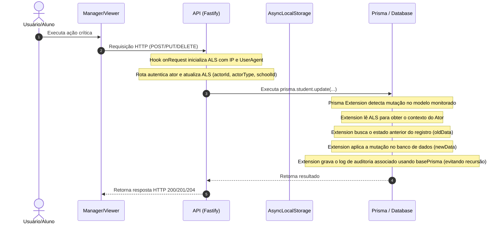

# Sistema Global de Auditoria (Enterprise Audit System)

O Ecokids possui um sistema completo, imutável e centralizado de auditoria para rastrear ações críticas realizadas na plataforma por administradores, membros, alunos e operações do sistema.

---

## 1. Arquitetura

O sistema utiliza uma abordagem **híbrida e centralizada** composta por:

1. **Tabela Única Centralizada (`audit_logs`)**: Todos os logs do sistema são armazenados em uma única tabela para facilitar pesquisas, relatórios e filtros.
2. **Interceptação Automática via Prisma Client Query Extensions**: Mutação de dados críticos (criação, edição e exclusão) nas tabelas monitoradas são capturadas automaticamente sem a necessidade de código manual espalhado em rotas.
3. **Injeção de Contexto via AsyncLocalStorage**: Para capturar metadados do request HTTP (IP, User-Agent, ator autenticado e escola escopada) na camada do Prisma, é utilizado o mecanismo nativo `AsyncLocalStorage` do Node.js.
4. **Log Manual para Eventos Especiais**: Para eventos sem mutação de banco direta, como `LOGIN`, `AUTH_FAILURE` (falhas de login) e `SECURITY_VIOLATION` (violações de acesso barradas pelo CASL), os logs são gerados por um helper centralizado.

---

## 2. Estrutura do Banco de Dados

A tabela `audit_logs` contém os seguintes campos:

- `id`: Identificador UUID v4 autogerado (PK).
- `schoolId`: ID da escola onde a ação ocorreu (opcional/nulo para ações globais).
- `actorId`: ID do usuário ou aluno que executou a ação (nulo para o sistema/tarefas de background).
- `actorType`: Tipo do ator (`USER` | `STUDENT` | `SYSTEM`).
- `entityType`: Nome do modelo/entidade afetada (ex: `Student`, `Class`, `Item`, etc.).
- `entityId`: ID único da entidade afetada.
- `action`: Ação simplificada (`CREATE` | `UPDATE` | `DELETE` | `SCORE` | `LOGIN` | `AUTH_FAILURE` | `APPROVE` | `REJECT` | `CANCEL` | `DELIVER` | `SECURITY_VIOLATION`).
- `description`: Texto explicativo resumido em português.
- `oldData`: Estado anterior do registro antes da modificação (JSON).
- `newData`: Novo estado do registro após a modificação (JSON).
- `metadata`: Informações extras/auxiliares específicas do evento (JSON).
- `ipAddress`: Endereço IP de origem da requisição.
- `userAgent`: Cabeçalho User-Agent do navegador/cliente HTTP.
- `createdAt`: Carimbo de data/hora do registro (autogerado).

---

## 3. Fluxo de Execução Automático



---

## 4. Modelos Auditados Automaticamente

Mutações nos seguintes modelos do banco de dados são interceptadas de forma transparente pelo Prisma Query Extension:

- `User`
- `Student`
- `Class`
- `School`
- `Member`
- `Invite`
- `Point`
- `Item`
- `Award`
- `ExchangeSeason`
- `RewardRedemption`
- `SchoolSeason`

---

## 5. Adicionando Logs Manuais (Exceções)

Para registrar ações que não representam mutações diretas nas tabelas auditadas, utilize a função `recordAuditLog`:

```typescript
import { recordAuditLog } from '@/lib/audit-service'

await recordAuditLog({
  schoolId: school.id,
  actorId: user.id,
  actorType: 'USER',
  entityType: 'User',
  entityId: user.id,
  action: 'LOGIN',
  description: `Usuário ${user.email} realizou login no sistema.`,
  ipAddress: request.ip,
  userAgent: request.headers['user-agent'],
})
```

---

## 6. Boas Práticas e Regras para Modificações Futuras

- **Imutabilidade**: Os registros da tabela `audit_logs` são permanentes. Nunca implemente endpoints ou queries para atualizar (`UPDATE`) ou remover (`DELETE`) registros desta tabela.
- **Novos Modelos Críticos**: Ao adicionar qualquer modelo que altere dados sensíveis da escola, inclua seu nome na constante `AUDITED_MODELS` localizada no arquivo `apps/api/src/lib/prisma.ts`.
- **Novos Fluxos de Negócio**: Toda nova funcionalidade crítica deve ser avaliada para verificar a necessidade de logs específicos (caso não seja coberta automaticamente pelo Prisma Extension).
