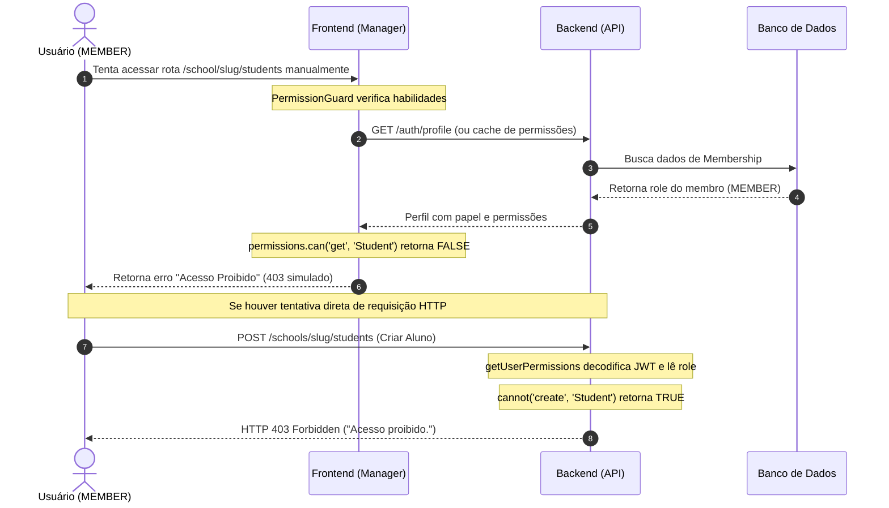

# AUTHORIZATION.md

> Documentação do sistema de permissões e controle de acesso baseado em papéis (RBAC) com CASL.

---

## Introdução

O controle de acesso no Ecokids é baseado na biblioteca **CASL** (Common Ability Schema Language). As regras de autorização são compartilhadas de forma isomórfica entre o backend (API) e o frontend (Manager), garantindo que as validações de permissões sejam consistentes e seguras em ambas as camadas.

---

## Estrutura do CASL

### 1. Definição de Habilidades e Assuntos (`@ecokids/auth`)

O pacote `@ecokids/auth` centraliza as definições de permissão da aplicação.

- **Ações e Assuntos**: Definidos na pasta `packages/auth/src/subjects/`. Cada arquivo define os tipos e ações suportados por uma entidade (ex: `Student`, `Class`, `Item`, `Award`, `SchoolSeason`, etc.).
  - Exemplo (`school-season.ts`):
    ```typescript
    export const schoolSeasonSubject = z.tuple([
      z.union([
        z.literal('manage'),
        z.literal('get'),
        z.literal('create'),
        z.literal('update'),
        z.literal('delete'),
        z.literal('download_report'),
      ]),
      z.literal('SchoolSeason'),
    ])
    ```

- **Matriz de Permissões**: Definida em `packages/auth/src/permissions.ts`. Associa cada papel (`Role`) às suas respectivas regras:
  - **ADMIN**: Permissão irrestrita (`can('manage', 'all')`).
  - **MEMBER**: Acesso restrito apenas para visualizar dados no dashboard (`can('get', 'SchoolSeason')`).

---

## Validação de Permissões na API

A segurança real das rotas é garantida no backend, respondendo com **`403 Forbidden`** caso o usuário tente realizar uma ação não permitida.

> [!NOTE]
> Anteriormente, a API retornava `401 Unauthorized` em caso de erro do CASL, o que forçava o logout automático do usuário no frontend. Agora, o erro adequado `ForbiddenError` (HTTP 403) é lançado, bloqueando o acesso sem derrubar a sessão ativa.

### Padrão de Implementação na Rota

```typescript
import { ForbiddenError } from '@/http/routes/_errors/forbidden-error'
import { getUserPermissions } from '@/utils/get-user-permissions'

// ... dentro do route handler
const userId = await request.getCurrentEntityId()
const { membership } = await request.getUserMembership(schoolSlug)
const { cannot } = getUserPermissions(userId, membership.role)

if (cannot('create', 'Student')) {
  throw new ForbiddenError('Você não tem permissão para criar alunos.')
}
```

---

## Validação de Permissões no Frontend

O frontend (Manager) protege a interface do usuário em duas frentes: visual/menu e navegação por rotas.

### 1. Hook de Permissões (`usePermissions`)

Disponibiliza a instância do `Ability` do CASL e o estado de carregamento das informações do usuário.
```typescript
const { permissions, isLoading } = usePermissions()
const canGetStudents = permissions?.can('get', 'Student')
```

### 2. Controle de Navegação/Tabs (`tabs.tsx`)

Links no menu de sub-navegação são ocultados caso o usuário não tenha permissão de leitura (`get`) sobre a respectiva entidade.
```tsx
{canGetStudents && (
  <NavLink to={`/school/${schoolSlug}/students`}>
    <GraduationCap className="size-4" />
    Alunos
  </NavLink>
)}
```

### 3. Guarda de Rotas (`PermissionGuard`)

Um componente protetor centralizado intercepta o acesso direto por URL e impede a renderização de componentes de página não autorizados, exibindo uma tela de erro amigável.
```tsx
// routes.tsx
{
  path: '/school/:slug/students',
  element: (
    <PermissionGuard action="get" subject="Student">
      <Students />
    </PermissionGuard>
  )
}
```

---

## Fluxo Completo de Autorização


