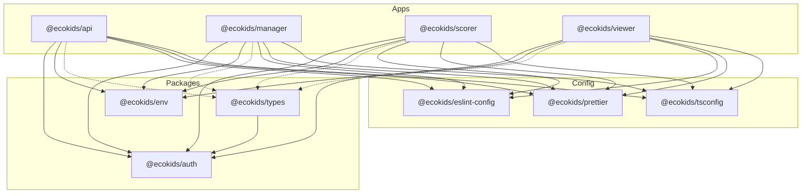
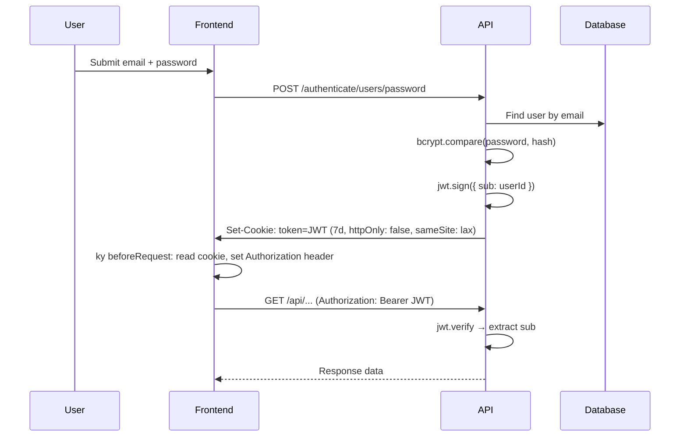

# ARCHITECTURE.md

> High-level architecture, module boundaries, package relationships, and system flow.

---

## System Overview

Ecokids is a **Turborepo monorepo** containing four applications and three shared packages that together form a school-based recycling rewards platform.

```
┌─────────────────────────────────────────────────────────────┐
│                        Frontend Apps                        │
│  ┌──────────┐   ┌──────────┐   ┌──────────┐                │
│  │ Manager  │   │  Scorer  │   │  Viewer  │                │
│  │ (Vite)   │   │ (Vite)   │   │ (Vite)   │                │
│  │ :5173    │   │ :5174    │   │ :5175    │                │
│  └────┬─────┘   └────┬─────┘   └────┬─────┘                │
│       │              │              │                       │
│       └──────────────┼──────────────┘                       │
│                      │ HTTP (ky)                            │
│                      ▼                                      │
│  ┌──────────────────────────────────┐                       │
│  │          API (Fastify)           │                       │
│  │           :3333                  │                       │
│  └───────┬──────────────┬───────────┘                       │
│          │              │                                   │
│          ▼              ▼                                   │
│  ┌──────────┐   ┌──────────────┐                            │
│  │PostgreSQL│   │ Cloudflare R2│                            │
│  │ (Docker) │   │   (S3 API)   │                            │
│  │  :5432   │   │              │                            │
│  └──────────┘   └──────────────┘                            │
└─────────────────────────────────────────────────────────────┘
```

---

## Application Roles

| App | Package Name | Purpose | Users |
|---|---|---|---|
| **manager** | `@ecokids/manager` | Admin dashboard for school management — classes, students, members, invites, awards, items, settings | Teachers, administrators |
| **scorer** | `@ecokids/scorer` | Scoring kiosk — login as student by code, register recycled items, assign points | Scoring operators |
| **viewer** | `@ecokids/viewer` | Student-facing app — view ranking, points history, shop (awards) | Students |
| **api** | `@ecokids/api` | REST API backend — all business logic, database access, file storage, auth | All apps (programmatic) |

---

## Monorepo Structure

### Workspace Layout

```
pnpm-workspace.yaml
├── apps/*        → Application code
├── packages/*    → Shared runtime libraries
└── config/*      → Shared tooling configuration
```

### Package Dependency Graph



> **Legend**: Solid arrows = runtime dependency. Dashed arrows = devDependency (types used at compile time).

### Package Purposes

| Package | Scope | Description |
|---|---|---|
| `@ecokids/auth` | Runtime | CASL-based authorization — role definitions, permission rules, subject schemas |
| `@ecokids/env` | Runtime | Zod-validated environment variables via `@t3-oss/env-nextjs` |
| `@ecokids/types` | Dev/Runtime | Shared Zod schemas for API contracts — body, params, response types |
| `@ecokids/eslint-config` | Dev | Shared ESLint configs extending `@rocketseat/eslint-config` |
| `@ecokids/prettier` | Dev | Shared Prettier config with Tailwind plugin |
| `@ecokids/tsconfig` | Dev | Shared TypeScript base configs (node, library) |

---

## Backend Architecture (API)

### Layer Diagram

```
HTTP Request
    │
    ▼
┌──────────────────────────┐
│      server.ts           │  Boot: plugins, CORS, JWT, Swagger, S3, routes
└──────────┬───────────────┘
           │
           ▼
┌──────────────────────────┐
│    Middleware (auth.ts)   │  JWT verification, user membership resolution
└──────────┬───────────────┘
           │
           ▼
┌──────────────────────────┐
│    Route Handler         │  Zod validation → business logic → Prisma query → response
│    (one file per route)  │
└──────────┬───────────────┘
           │
     ┌─────┴─────┐
     ▼           ▼
┌─────────┐ ┌─────────┐
│ Prisma  │ │   S3    │
│ Client  │ │ Client  │
└─────────┘ └─────────┘
```

### Key Design Decisions

1. **No service/repository layer** — Route handlers directly call Prisma. Business logic lives inline in route handlers.
2. **One handler per file** — Each file exports a single `async function` that registers one endpoint.
3. **Route registration via barrels** — Each domain folder has an `index.ts` exporting `registerXRoutes(app)`.
4. **Zod as single validation source** — Schemas from `@ecokids/types` used in both Fastify schema config and response typing.
5. **S3 client as Fastify decorator** — `app.s3Client` is available in all routes after decoration in `server.ts`.

### Error Flow

```
Route Handler throws
    │
    ├── ZodError       → 400 + field errors
    ├── BadRequestError → 400 + message
    ├── UnauthorizedError → 401 + message
    └── Unknown        → 500 + "Internal server error"
```

---

## Frontend Architecture (Manager / Scorer / Viewer)

### Layer Diagram

```
┌─────────────────────────────────────────────────┐
│                   main.tsx                       │
│   StrictMode → App (QueryClientProvider, Router) │
└──────────────────────┬──────────────────────────┘
                       │
                       ▼
┌──────────────────────────────────────────────────┐
│               routes.tsx                         │
│   createBrowserRouter → Layout nesting            │
│   GlobalLayout → AppLayout / AuthLayout           │
└──────────────────────┬───────────────────────────┘
                       │
          ┌────────────┼────────────┐
          ▼            ▼            ▼
    ┌──────────┐ ┌──────────┐ ┌──────────┐
    │  Pages   │ │Components│ │  Hooks   │
    │(features)│ │(ui/form) │ │(data)    │
    └────┬─────┘ └──────────┘ └────┬─────┘
         │                         │
         ▼                         ▼
    ┌──────────┐             ┌──────────┐
    │ Actions  │             │   HTTP   │
    │(actions.ts)            │ (api.ts + │
    └────┬─────┘             │ domain/) │
         │                   └────┬─────┘
         └────────────────────────┘
                    │
                    ▼  ky HTTP client
              ┌──────────┐
              │ API :3333│
              └──────────┘
```

### Layout Nesting

```
GlobalLayout (Middleware cookie sync + dayjs)
├── AppLayout (Auth guard + Header + Outlet)
│   └── [Authenticated pages]
├── AuthLayout (Redirect if authenticated + centered)
│   └── SignIn / SignUp
└── [Standalone pages: Invite, NotFound]
```

### Data Flow Pattern

```
User Action → Form (RHF + Zod) → Action function → HTTP function → API
                                       ↓
                              { success, message }
                                       ↓
                              Toast + Query Invalidation
```

---

## Authentication Flow



### Student Authentication (Scorer/Viewer)

Students authenticate via a separate endpoint (`/authenticate/students/password`) and receive the same JWT cookie mechanism, but their token `sub` resolves to a student ID rather than a user ID.

---

## Authorization Model

```
@ecokids/auth (CASL)
│
├── Roles: ADMIN, MEMBER
│
├── Subjects: School, Member, Invite, Class, Student, Point, Award, Item
│
├── ADMIN permissions:
│   └── manage all (full access)
│   └── transfer_ownership / update School (only if owner)
│
└── MEMBER permissions:
    └── get Member
    └── get Invite
```

The authorization check happens at two levels:
1. **API**: `getUserPermissions(userId, role)` → CASL ability → `can()`/`cannot()` guards
2. **Frontend**: `usePermissions()` hook → conditional rendering of UI elements

---

## Storage Architecture

### Database (PostgreSQL)

- **ORM**: Prisma with `@prisma/client`
- **Migrations**: `prisma/migrations/` managed via `prisma migrate dev`
- **Database Migration Policy**:
  - Direct schema synchronization (e.g. `prisma db push`, `prisma db reset`, or manually deleting migration files) is **forbidden**.
  - All database changes must go through migration files generated via `pnpm db:migrate` (internally running `prisma migrate dev`).
  - Migration history must be strictly preserved and committed.
- **Connection**: Single `PrismaClient` instance in `src/lib/prisma.ts`
- **Docker**: `bitnami/postgresql:latest` on port 5432

### File Storage (Cloudflare R2)

- **Client**: `S3ClientWrapper` class wrapping `@aws-sdk/client-s3`
- **Bucket**: Single bucket (`ecokids`)
- **Public URL**: `pub-d3d968addd1e4a6eb2ac5ec8758e10c8.r2.dev`
- **Operations**: Upload file, delete folder, list buckets
- **Used for**: School logos, award photos, item photos

---

## Build Pipeline

### Turborepo Task Graph

```json
{
  "build": { "dependsOn": ["^build"] },
  "lint":  { "dependsOn": ["^lint"] },
  "dev":   { "cache": false, "persistent": true }
}
```

- `build` is topologically ordered — packages build before apps
- `dev` is non-cacheable and persistent (long-running dev servers)
- `lint` respects dependency order

### Mandatory Final Validation Workflow

Before completing any task, the following validation checklist is mandatory:
1. **Linter Validation**: Run `pnpm lint`. The repository enforces a **Zero Warnings Policy**. If any lint issue is found, run `pnpm lint:fix` (or `eslint --fix`) and verify it runs cleanly.
2. **Build Validation**: Run `pnpm build`. It must compile and bundle cleanly with 0 build errors and 0 build warnings.

### Per-App Build Tools

| App | Build Tool | Dev Tool | Output |
|---|---|---|---|
| API | tsup | tsx watch | `dist/` (CJS) |
| Manager | vite build | vite | SPA bundle |
| Scorer | vite build | vite | SPA bundle |
| Viewer | vite build | vite | SPA bundle |

---

## Module Boundaries

### Hard Boundaries (Enforced)

1. **API ↔ Frontend**: Communication only via HTTP REST. No shared runtime code except `@ecokids/types` (schemas) and `@ecokids/auth` (CASL definitions).
2. **Packages are standalone**: `@ecokids/auth`, `@ecokids/env`, `@ecokids/types` have no cross-dependencies (except `types → auth` for role schema).
3. **Config packages are dev-only**: ESLint, Prettier, and TypeScript configs are never imported at runtime.

### Soft Boundaries (Convention)

1. **Frontend apps are independent**: Manager, Scorer, and Viewer do not share components or hooks directly — they each have their own copies.
2. **Domain isolation in routes**: API routes are grouped by domain folder. Each domain has its own index barrel.
3. **HTTP layer isolation**: Frontend HTTP functions mirror API route grouping — one folder per domain.

### Known Boundary Violations

- Frontend apps duplicate the `api.ts` ky client, `auth/index.ts`, and hook files identically across apps instead of sharing via a package.
- `@ecokids/env` uses `@t3-oss/env-nextjs` despite none of the frontend apps being Next.js.
